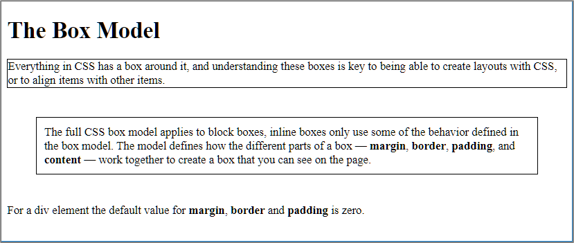
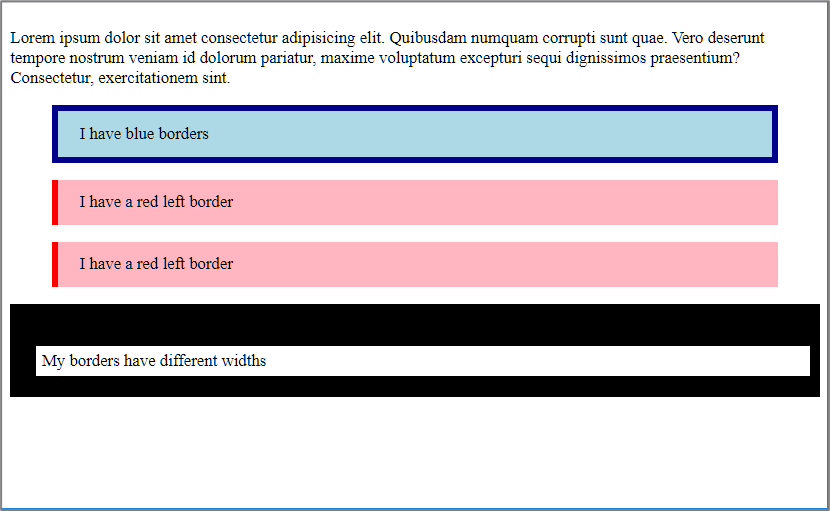
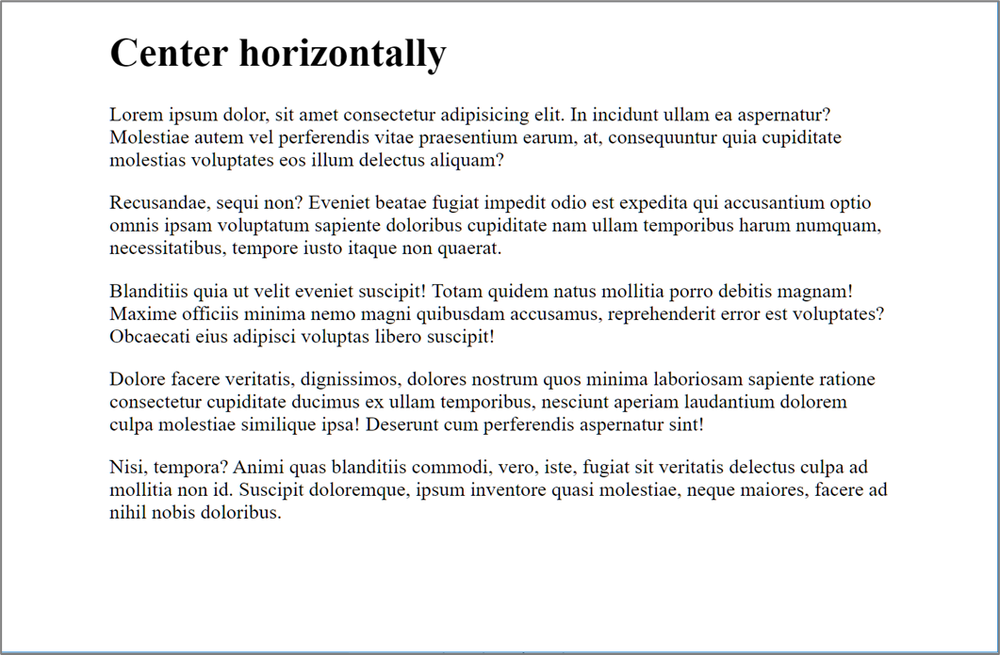
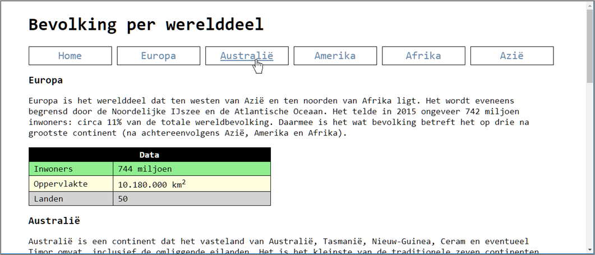

# Les 7 - Starter oefeningen H9 - Lay-out: boxmodel en weergavemodel

Download en unzip, of clone deze repository. Hiervoor klik je op de groene knop.

## Oefening 1 - Box Model

- Open de webpagina **01_box_model.html**.

- Geef de div-elementen een boven- en ondermarge van 1 em. De linker- en rechtermarge moet je niet aanpassen, deze blijven behouden op 0 pixels.
Maak gebruik van de 'shorthand notation'.<br>
***Opmerking*** De div-elementen zien er nu uit als p-elementen.
- Geef het eerste div-element een zwarte rand van 1 pixel breed.
- Stel voor het tweede div-element de volgende CSS-eigenschappen in:
  - een zwarte rand van 1 pixel breed;
  - een padding van 10 pixels;
  - marges van 40 pixels;
- Gebruik de Chrome Developer Tools (Elements > Computed) om voor elk div-element margin, border en padding te controleren.

Te bekomen resultaat:


  

## Oefening 2 - Box Model

- Creëer een nieuwe webpagina **02_box_model.html**. Plaats in de webpagina twee div-elementen. Eén met  id="box1" en één met id="box2".

- Plaats in de eerste div de tekst "Ik ben het eerste div-element" en plaats in de tweede div Lorem Ipsum-tekst.

- Maak in de css-map een file **02_box_model.css**, link deze aan je webpagina en voeg CSS-code toe zodat *box1* een oranje rand krijgt met een breedte van 5 pixels en *box2* een blauwe rand met een breedte van eveneens 5 pixels.

Te bekomen resultaat:


- Stel nu de breedte van *box1* in op 640 pixels en maak vervolgens met je muis het browservenster smaller dan 640 pixels.
  
  Merk op dat als je jouw browservenster met je muis versmalt, de breedte en de hoogte van *box2* automatisch worden aangepast, maar dat dit niet het geval is voor *box1*, waar we via CSS de breedte vast ingesteld hebben.
  
- Voorzie beide boxes van 20 pixels witruimte tussen de rand en de tekst. 
  
- Stel de hoogte van *box2* in op 20 pixels. 
  
- Als je jouw browservenster smaller maakt, zal bij *box2* sommige tekst buiten de box komen te staan. Verberg deze tekst met behulp van CSS-code.
  
Te bekomen resultaat:


De bovenstaande schermafbeelding is misschien toch niet wat we wensen?

- Vervang bij het eerste div-element 'width: 640px' door 'max-width: 640px;', zodat er geen horizontale schuifbalk meer is.
- Plaats de regels 'height: 20px;' en 'overflow: hidden;' in commentaar.
  

## Oefening 3 - Box Model

- Open de webpagina **03_box_model.html** in Google Chrome.

- Boven en links van de twee div-elementen is er enige witruimte. Gebruik de Chrome Developers Tools om na te gaan van waar deze witruimte vandaan komt en verwijder vervolgens de witruimte. <br><!-- kleinere afbeelding -->
  

- Geef vervolgens *box1* een ondermarge van 20 pixels.
- En geef *box2* een bovenmarge van 15pixels.<br>
Waarom heeft het instellen van deze bovenmarge geen effect?

## Oefening 4 - Borders

- Open de webpagina **04_borders.html**.

- Definieer in de bijbehorende css-file de twee ontbrekende classes `alert-info` en `alert-danger` zodat 

  - de tweede paragraaf een 'lightblue' achtergrondkleur en een 'darkblue' rand van 6 pixels breed krijgt.
  - de derde en vierde paragraaf worden weergegeven met een rode linkerrand van 6 pixels breed en een 'lightpink' achtergrondkeur. 

- Voor de laatste paragraaf zijn onderstaande vier css-declaraties ingesteld die zorgen voor vier randen van verschillende dikte. Vervang deze vier declaraties door één declaratie (shorthand notation).
```
    border-left-width: 25px;
    border-right-width: 10px;
    border-top-width: 40px;
    border-bottom-width: 20px;
```
Te bekomen resultaat:



## Oefening 5 - Center horizontally

- Open de webpagina **05_center_horizontally.html**.
- Geef het main-element een breedte van 80% en centreer het element.
- Zorg ervoor dat het main-element nooit breder wordt dan 838 pixels.

Te bekomen resultaat bij een schermresolutie van 800x600:



Te bekomen resultaat bij een schermresolutie van 1200x800:


## Oefening 6 - Scrollbars

- Open de webpagina **06_scrollbars.html**.
- Voeg verticale schuifbalken toe aan beide articles (zie schermafbeelding hieronder).
- Voeg links en rechts van de teksten in de article-elementen wat witruimte toe. De afstand tussen de tekst en linker/rechterrand van de article-elementen moet 0,5 rem zijn.
- Voeg 1 rem witruimte toe tussen de twee kaders (articles).

Te bekomen resultaat:


## Oefening 7 - box-sizing

- Open de webpagina **07_box-sizing.html**.
  
  

- Zorg ervoor dat de blauwe box even breed en even hoog wordt als de rode box, door zijn CSS-eigenschappen `width` en `height` aan te passen. Je mag hierbij geen andere CSS-eigenschappen wijzigen.

## Oefening 8 - Weergavemodel

- Open de webpagina **08_display.html**.


  Merk op dat de twee span-elementen een vet lettertype, een blauwe rand van 1 pixel breed en een lichtblauwe achtergrond hebben.

- Verberg het eerste span-element, maar zorg ervoor dat de ruimte ingenomen door het element behouden blijft.<br>
Verberg het tweede span-element volledig, nu mag er dus geen witruimte in de plaats van het element komen.


- Maak beide elementen terug zichtbaar door de declaraties in commentaar te plaatsen.
- Geef het tweede span-element een breedte van 100 pixels en een hoogte van 50 pixels.<br>
  Waarom heeft het instellen van de breedte en de hoogte geen effect?
- Hoe breed zal elk span-element worden als we de css-eigenschap `display` instellen op `block`?<br>
Voer dit effectief uit en controleer of je antwoord juist was.

## Oefening 9 - Werelddelen

- Open de map **werelddelen**.

In deze oefening moet je het navigatiemenu in **index.html** opmaken met CSS.

Uiteindelijk te bekomen resultaat:



In CSS3 is de beste manier om li-elementen in een nav-element naast elkaar te plaatsen, gebruikmaken van Flex. Daar we Flex nog niet gezien hebben in de lessen zullen we momenteel een andere werkwijze gebruiken, die je ook nog op veel websites ziet.

Voer onderstaande opdrachten uit om het navigatie-menu op te maken.

**Navigatiemenu:**

- Wat is de standaardwaarde van de CSS property **<code>display</code>** voor li-elementen?<br>
Plaats de li-elementen in het nav-element naast elkaar door er inline elementen van te maken, m.a.w. stel **<code>display</code>** in op **<code>inline</code>**.
- Stel vervolgens de breedte van de li-elementen in op 170 pixels.
  Waarom heeft de breedte instellen geen effect?
- Stel voor de li-elementen **<code>display</code>** in op **<code>inline-block</code>**. De li-elementen blijven hierdoor inline elementen, maar hebben toch ook block-eigenschappen.
- Stel voor de hyperlinks:
  - de lettergrootte in op 1,2 em
  - de letterkleur in op \#6789ab
  - een zwarte rand in van 1 pixel 
- De hyperlinks in de nav zijn momenteel inline elementen. Maak hiervan block elementen (technische opmerking: de reden dat er na elke hyperlink hierdoor geen nieuwe regel zal genomen worden is omdat de display:inline-block ingesteld op de li-elementen, een nieuwe Block Formatting Context (BFC) genereert).
  De a-elementen worden nu even breed als de li-elementen omdat block elementen steeds de volledige breedte van hun parent innemen. 
- Merk op dat er enige witruimte is tussen de verschillende li-boxen. Dit is de spatie die tussen de li-elementen staat. Controleer eventueel nog eens met de developer tools dat de li-elementen inderdaad geen padding en margin hebben en dat ook de a-elementen geen margin hebben.
- Geef de a-elementen:
  - 5 pixels padding
  - centreer de teksten
- De hyperlinks mogen enkel onderlijnd worden weergegeven als je er met de muis over beweegt.
- Verwijder padding en margin op het ul-element.

**Pagina layout:**

Geef header, nav en main een vaste breedte van 1080 pixels en centreer de elementen.